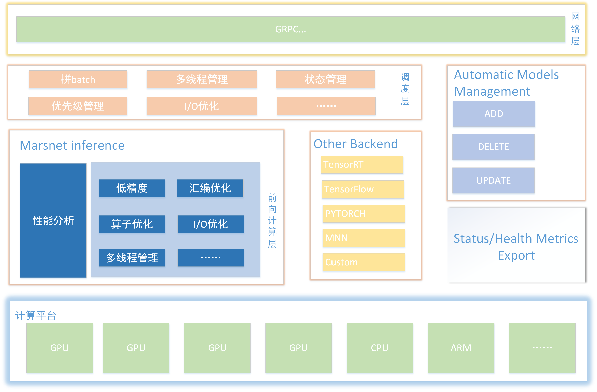

# Mars

<!--  -->

## 简介

Mars是搜狗AI自研的一款以自动化、智能化为目标，适配复杂的AI算法落地场景的通用前向推理引擎服务框架，具备高性能、跨平台、动态Batch调度、流式支持、模型自动管理等众多特性。Mars框架有机结合了MarsNet推理引擎、Schedule调度引擎、gRPC网络层，并辅以自动化模型管理和服务状态监控机制，提供了高性能、高灵活性和高可用的前向推理服务。Mars框架广泛应用于搜狗AI交互技术部如语音识别、合成、图像识别、翻译等各项业务中，极大的加快了各业务AI算法的迭代和上线。

<!--  -->

## 如何使用

  如果你有一个已经训练好的模型, 那么一般而言通过以下四个步骤就能通过Mars完成模型在GPU上的部署。

1. 第一步是把训练好的模型转换成MarsNet的模型。为此我们提供了丰富的工具来帮助你完成这一步，无论你使用的是 TensorFlow、PyTorch，都可以轻松完成转换。详细的手把手教程可以参见这里[如何转换模型](./marsnet/model_convert.md)。

2. 第二步是配置网络结构。考虑到模型的易用性和扩展性，Mars使用json格式配置网络结构；对于一些经典网络结构，Mars提供了网络模型文件，使用非常方便。详细步骤可以参考这里[网络结构配置](./marsnet/model_config.md)。

3. 第三步是根据目标平台，编译MarsNet，提供CPU/GPU/ARM等不同平台的前向推理库

4. 最后一步就是根据Mars提供的[接口](./schedule/api.md)，在应用程序中嵌入Mars，构建前向推理服务。这方面我们提供了丰富而详实的demo来帮助你完成。

## 技术能力

### MarsNet推理引擎

1. [简要介绍](./marsnet/introduction.md)

2. [支持能力](./marsnet/support.md)

3. [接口设计](./marsnet/api.md)

4. [模型转换](./marsnet/model_convert.md)

5. [模型配置](./marsnet/model_config.md)

### Schedule调度引擎

1. [简要介绍](./schedule/introduction.md)

2. [接口设计](./schedule/api.md)

### 自动化模型管理

TODO

### 服务状态监控

TODO

## 支持业务

| 业务 | 技术方向 | 输入 | 输出 | Batch类型 | 支持情况 |
| :------: | :------: | :------: | :------: | :------: | :------: |
| CV类 | 图像识别 | 非流式 | 非流式 | 无状态Batch | ✔︎ |
| NLP类 | 机器翻译 | 非流式 | 非流式 | 无状态Batch | ✔︎ |
| SPEECH类 | 语音合成 | 流式+非流式 | 流式 | 无状态+有状态Batch | ✔︎ |
| SPEECH类 | 语音变声 | 流式 | 流式/非流式 | 有状态Batch | ✔︎ |
| SPEECH类 | 语音识别 | 流式 | 流式 | 有状态Batch | ✔︎ |
