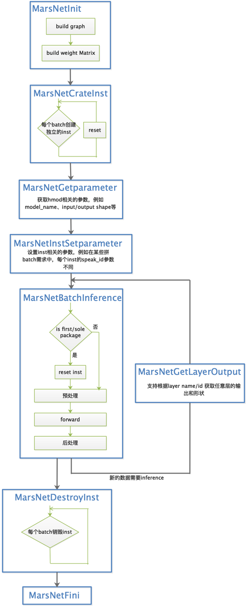

# MarsNet

## 简介

MarsNet是一套以高性能、跨平台、易定制为设计目标的前向推理组件，支持动态批大小的批数据、流式/非流式数据的推理，且提供了一套简单易用的api接口。

<!--  -->

## 特性

- 支持动态批大小的批处理
- 每个层都支持流式处理
- 易于使用的api接口
- 丰富的模型转换工具

## 接口调用流程

<!--  -->

## 相关概念介绍

### Module

在MarsNet中Module为一个全局的前向推理句柄，一个模型对应一个Module。

### Instance

在MarsNet中Instance为一次会话请求，如果一次会话有多个batch输入，应当为每个batch创建独立的Instance，当会话结束后销毁对应的Instance。

### FrameType

MarsNet支持流式/非流式数据输入。所有输入的数据分为FIRST、MID、LAST、SOLE四种帧类型，分别对应首包、中间包、尾包、整包。
