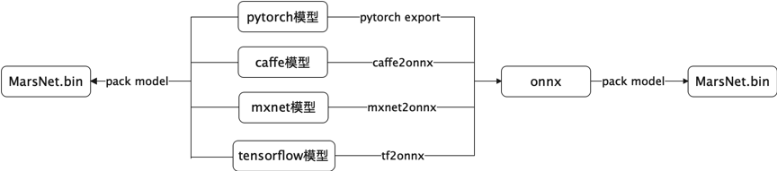

# 模型专换工具

MarsNet将[Numpy](https://numpy.org/doc/stable/contents.html)作为中间媒介，进行模型参数转换。

<!--  -->

## 转换步骤

1. 读取深度学习框架的参数，转换为numpy;获取参数三要素:(name, shape, value)
2. 对参数名称进行规范化处理
3. 将numpy格式参数转为Mars格式参数

## 转换示例脚本

1. [tf2mars.py](./model_convert/tf2mars.md)
2. [torch2mars.py](./model_convert/pytorch2mars.md)

## 参数名称处理规则

参数由`op`前缀命名空间`scope`和`op`里名称组合而成，参数名称规划化处理是将`op`不同网络框架下的内部名称统一成一套，目前按照PyTorch格式对齐。如将`scope/kernel->scope/weights`。

| 层类型 | 表达式 | W | bias | 说明 |
| :------: | :------: | :------: | :------: | :------: |
| **Dense** | y = W * x + b | scope + "weights" | scope + "biases" | |
| **Conv** | y = Conv(x) + b | scope + "weights" | scope + "biases" | W是卷积核 |
| **BatchNorm** | y = Scale * (x-Mean) / sqrt(eps+Var) + Bias | scope + "weights" scope + "running_mean" scope + "running_var" | scope + "biases" | W包含BN权重、mean和var |
| **Lstm** | | scope + "/weights_wxi" scope + "/weights_wxj" scope + "/weights_wxf" scope + "/weights_wxo" scope + "/weights_wci" scope + "/weights_wcj" scope + "/weights_wcf" scope + "/weights_wco" | scope + "/biases_bi" scope + "/biases_bj" scope + "/biases_bf" scope + "/biases_bo" | W和Bias包含四个门 |
