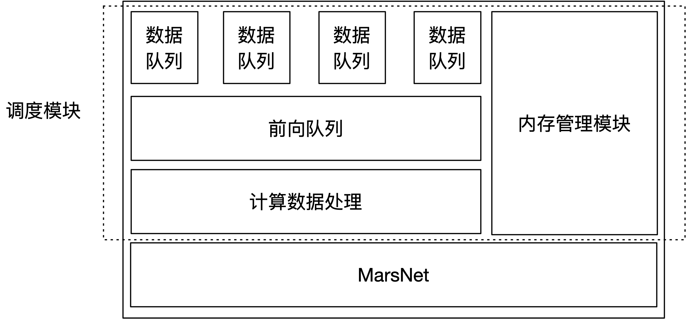

# Schedule

## 简介

Schedule调度模块是一个基于MasrNet后端的，以易用、高吞吐为设计目标的调度组件，支持动态批大小的批数据处理、流式数据处理。调度模块提供一组统一的、简单易用的api，用户都可以通过使用这组api来完成全部的前向推理工作，而不直接和MasrNet后端进行交互，且无需根据模型本身的性质来选择调度器。目前，调度模块支持配置文件以及动态设置两种方式来设置它工作模式。

<!--  -->

## 特性

- 全面的流式处理支持
- 支持动态批大小的批处理
- 高效的内存管理，overhead小
- 不固定的调度间隔，在低负载和高负载情况下都能有良好的性能表现
- 易于使用的简单api，调度细节对用户透明

## 模块介绍

### module

在调度模块中，一个module对应于一个前向模型，及该模型相应的资源占用。一般上，module是一个全局资源，同一个模型的前向请求应该对应于同一个module。通过调用`scheInit`来创建一个module；通过调用`scheUninit`来销毁一个module。通过调用`scheSetParameter`来设置module相关的参数；通过调用`scheGetParameter`来获取module的某个参数值。

### instance

在调度模块中，一个instance对应于一个会话上下文，每个会话应当创建一个instance，在会话结束的时候销毁之。instance也可以进行池化，在会话间复用以节省开销，但应该注意上一个会话需要完成处理流程。通过调用`scheCreateInst`来创建一个instance；通过`scheDesoryInst`来销毁一个instance。

### 流式处理

在调度模块中，每一次计算都是流式处理，无论后端模型是否是有状态的。它通过区分输入类型来支持非流式处理，输入类型由用户指定，在每次调用`scheProcess`的时候给出，共分为四种

- FIRST

  这意味着会话开始第一次调用`scheProcess`，且不是最后一次。FIRST类型数据的长度是大于0的任意值。

- MID

  这意味着会话开始后，既非第一次调用`scheProcess`，也不是最后一次。MID类型的数据长度是任何非负值。

- LAST

  这意味着这是本次会话最后一次调用`scheProcess`，且不是第一次。LAST类型的数据长度是任何非负值。完成这次调用后，模型状态将会重置，然后可以开始下一次会话。

- SOLE

  这意味着这是本次会话唯一一次调用`scheProcess`。SOLE类型数据的长度是大于0的任意值。完成这次调用后，模型状态将会重置，然后可以开始下一次会话。

一个完整的会话中，合法的输入序列，是且仅是下面两种模式之一

- SOLE
- FIRST [MID]*N LAST, 其中N是0或者正整数

满足以上约束的调用都是合法调用，调度模块会提供一个尽量快的流式返回。

### 动态批大小的批处理

调度目前只支持对用户透明的批处理方式，用户不能对其进行干预。通过设置`sche.max_batch_size`参数可以控制单次计算最大的批大小。若不希望调度模块进行批计算（如显存资源过小、后端不支持批处理），可以通过设置最大批大小为1来实现。用户可以通过设置`sche.running_mode`来控制批处理模式，目前支持的批处理模式有

- 固定长度批计算模式，有且仅有FIRST、MID类型的数据会进行批计算。

- 非流式模式批计算模式，有且仅有SOLE类型的数据会进行批计算。

- 任意类型批计算模式，对任意类型能够的数据进行批计算

  （上述数据类型是与后端交互时的类型，与[流式处理](#流式处理)一节所述的类型并不相同）

应当根据后端的特性来选择批处理模式，如有的后端模型并不支持任意类型批计算模型，那么使用任意类型批计算模式会带来不可预见的结果。
